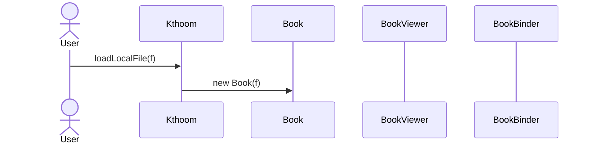

```mermaid
sequenceDiagram
    actor User
    participant K as Kthoom
    participant B as Book
    participant BV as BookViewer
    participant BB as BookBinder

    User->>K: loadLocalFile(f)
    K->>B: new Book(f)
```
