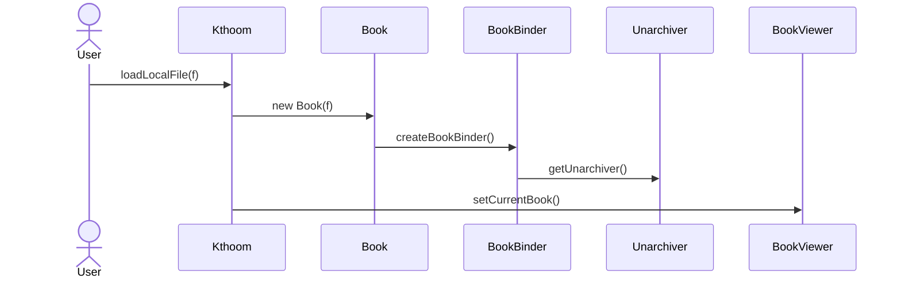
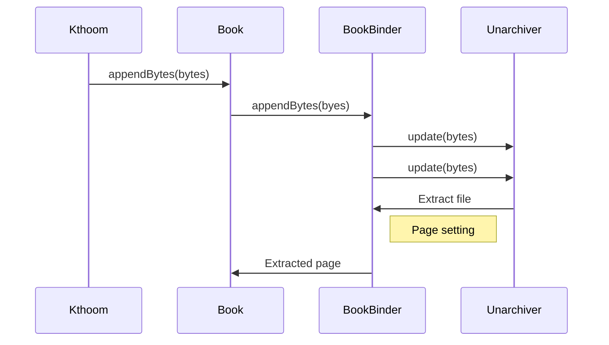

## Creation

```mermaid
sequenceDiagram
    actor User
    participant K as Kthoom
    participant B as Book
    participant BB as BookBinder
    participant UA as Unarchiver
    participant BV as BookViewer

    User->>K: loadLocalFile(f)
    K->>B: new Book(f)
    B->>BB: createBookBinder()
    BB->>UA: getUnarchiver()
    K->>BV: setCurrentBook()
```

## Book Binding

```mermaid
sequenceDiagram
    participant K as Kthoom
    participant B as Book
    participant BB as BookBinder
    participant UA as Unarchiver

    K->>B: appendBytes(bytes)
    B->>BB: appendBytes(byes)
    BB->>UA: update(bytes)
    BB->>UA: update(bytes)
    UA->>BB: Extract file
    Note right of BB: Page setting
    BB->>B: Extracted page
```
